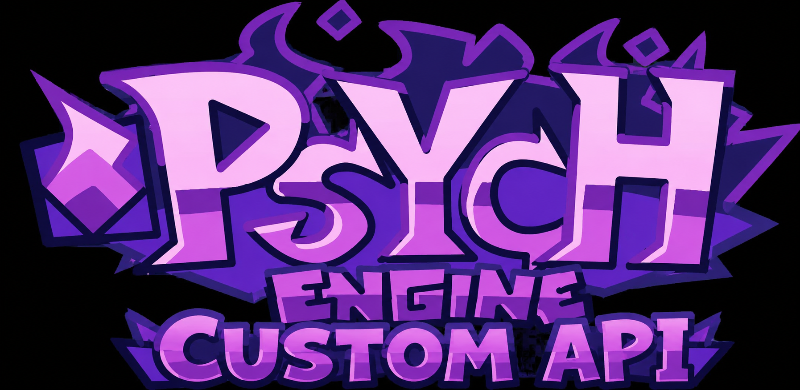

**Friday Night Funkin': Psych Engine** — A feature-rich FNF modding engine with multi-API rendering support (Metal, Vulkan, DirectX 12, OpenGL).

---

# 编译指南 / Build Guide

## 前置依赖 / Prerequisites

| 依赖 / Tool | 版本 / Version | 说明 / Notes |
|---|---|---|
| **Haxe** | 4.3.2+ | [download](https://haxe.org/download/version/4.3.2) |
| **git** | any | [download](https://git-scm.com) |
| **macOS** | Xcode CLT | `xcode-select --install` |
| **Windows** | Visual Studio 2022 | `VC.Tools.x86.x64` + `Windows10SDK.19041` |
| **Linux** | g++ / libvlc-dev | `sudo apt install g++ libvlc-dev` |

## 快速开始 / Quick Start

### macOS / Linux

```bash
cd FNF-PsychEngine-1.0.4
chmod +x setup/unix.sh
./setup/unix.sh
haxelib run lime build mac     # macOS
haxelib run lime build linux   # Linux
```

### Windows

```cmd
cd FNF-PsychEngine-1.0.4
setup\windows.bat
haxelib run lime build windows
```

## 完整依赖清单 / Full Dependency List

执行 `setup/unix.sh` 或 `setup/windows.bat` 会自动安装以下所有依赖：

### Haxelib 包 / Haxelib Packages

| 包 / Package | 版本 / Version | 安装指令 / Install Command |
|---|---|---|
| **lime** | 8.1.2 | `haxelib install lime 8.1.2` |
| **openfl** | 9.3.3 | `haxelib install openfl 9.3.3` |
| **flixel** | 5.6.1 | `haxelib install flixel 5.6.1` |
| **flixel-addons** | 3.2.2 | `haxelib install flixel-addons 3.2.2` |
| **flixel-tools** | 1.5.1 | `haxelib install flixel-tools 1.5.1` |
| **hscript-iris** | 1.1.3 | `haxelib install hscript-iris 1.1.3` |
| **tjson** | 1.4.0 | `haxelib install tjson 1.4.0` |
| **hxdiscord_rpc** | 1.2.4 | `haxelib install hxdiscord_rpc 1.2.4` |
| **hxvlc** | 2.0.1 | `haxelib install hxvlc 2.0.1 --skip-dependencies` |
| **hxcpp** | 4.3.2 | `haxelib install hxcpp 4.3.2` |

### Git 包 / Git Packages

| 包 / Package | 仓库 / Repository | Commit |
|---|---|---|
| **flxanimate** | `https://github.com/Dot-Stuff/flxanimate` | `768740a` |
| **linc_luajit** | `https://github.com/superpowers04/linc_luajit` | `1906c4a` |
| **funkin.vis** | `https://github.com/FunkinCrew/funkVis` | `22b1ce0` |
| **grig.audio** | `https://gitlab.com/haxe-grig/grig.audio.git` | `cbf91e2` |

安装命令 / Install commands:
```bash
haxelib git flxanimate https://github.com/Dot-Stuff/flxanimate 768740a56b26aa0c072720e0d1236b94afe68e3e
haxelib git linc_luajit https://github.com/superpowers04/linc_luajit 1906c4a96f6bb6df66562b3f24c62f4c5bba14a7
haxelib git funkin.vis https://github.com/FunkinCrew/funkVis 22b1ce089dd924f15cdc4632397ef3504d464e90
haxelib git grig.audio https://gitlab.com/haxe-grig/grig.audio.git cbf91e2180fd2e374924fe74844086aab7891666
```

---

## bgfx 多 API 渲染 / bgfx Multi-API Rendering

Psych Engine 现在支持通过 bgfx 运行时切换渲染 API（Metal、Vulkan、DirectX 12、OpenGL）。

Psych Engine now supports runtime graphics API switching via bgfx (Metal, Vulkan, DirectX 12, OpenGL).

### 编译 bgfx 库 / Build bgfx Libraries

```bash
# macOS / Linux
cd libs/hxbgfx/project
chmod +x build_bgfx_libs.sh
./build_bgfx_libs.sh

# Windows (需要 Git Bash 或 WSL / requires Git Bash or WSL)
cd libs/hxbgfx/project
bash build_bgfx_libs.sh
```

脚本会自动：clone bgfx + bx + bimg → 编译静态库 → 复制到 `libs/hxbgfx/lib/<platform>/`

The script auto-clones bgfx + bx + bimg, compiles static libs, and copies them to `libs/hxbgfx/lib/<platform>/`.

### 各平台支持的 API / API Support by Platform

| 平台 / Platform | 可选 API / Available APIs | 默认 / Default |
|---|---|---|
| **macOS** | Metal, OpenGL | Metal |
| **Windows** | DirectX 12, Vulkan, OpenGL | DirectX 12 |
| **Linux** | Vulkan, OpenGL | Vulkan |

---

## 项目结构 / Project Structure

```
FNF-PsychEngine-1.0.4/
├── source/                  # Haxe 源码
│   ├── backend/             # 渲染后端 + 工具类
│   │   ├── GraphicsAPI.hx      # API 选择/切换
│   │   ├── GraphicsAPIType.hx  # 枚举类型定义
│   │   ├── RenderDevice.hx     # bgfx 渲染抽象层
│   │   ├── BgfxAPI.hx          # bgfx C API 接口
│   │   ├── BgfxFallback.hx     # 初始化/回退
│   │   ├── BgfxWindowManager.hx   # 窗口管理
│   │   ├── BgfxTextureManager.hx  # 纹理管理
│   │   ├── BgfxShaderManager.hx   # Shader 管理
│   │   ├── BgfxFlxDrawQuadsItem.hx # Flixel 渲染拦截
│   │   ├── ClientPrefs.hx      # 设置存储
│   │   └── ...
│   ├── shaders/             # 内嵌 GLSL Shader
│   ├── options/             # 设置菜单
│   ├── states/              # 游戏状态 (TitleState, PlayState, etc.)
│   └── hxbgfx/              # bgfx Haxe 类型 (预留)
├── libs/hxbgfx/             # bgfx 库 + 构建脚本
│   ├── project/
│   │   ├── Build.xml           # hxcpp 链接配置
│   │   ├── bgfx_bridge.cpp     # C 桥接层 (SDL → 原生窗口句柄)
│   │   ├── bgfx_bridge.h
│   │   └── build_bgfx_libs.sh  # bgfx 编译脚本
│   └── lib/                   # 编译产物存放
│       ├── macos/
│       ├── windows/x64/
│       └── linux/x64/
├── Project.xml              # Lime 项目配置
├── setup/unix.sh            # macOS/Linux 安装脚本
├── setup/windows.bat        # Windows 安装脚本
├── assets/                  # 游戏资源
└── docs/                    # 文档
```

---

## 配置选项 / Customization

### 图形 API / Graphics API

在 `Project.xml` 中：

```xml
<!-- bgfx 多 API 渲染（默认启用） -->
<define name="BGFX_RENDERER" />

<!-- 强制指定编译时 API（可选） -->
<!-- -D GRAPHICS_API_OPENGL   强制 OpenGL -->
<!-- -D GRAPHICS_API_METAL    强制 Metal -->
<!-- -D GRAPHICS_API_VULKAN   强制 Vulkan -->
<!-- -D GRAPHICS_API_DIRECTX12 强制 DirectX 12 -->
```

在游戏设置中（运行时切换，即时生效）：

```
Options → Graphics → Graphics Rendering API
  - Auto (平台最佳)
  - Metal / DirectX 12 / Vulkan
  - OpenGL
```

### 其他功能开关 / Feature Toggles

在 `Project.xml` 中注释/删除对应行：

| 功能 | Define |
|---|---|
| Lua 脚本 | `LUA_ALLOWED` |
| HScript | `HSCRIPT_ALLOWED` |
| 视频播放 | `VIDEOS_ALLOWED` |
| Discord RPC | `DISCORD_ALLOWED` |
| Mod 支持 | `MODS_ALLOWED` |
| 成就系统 | `ACHIEVEMENTS_ALLOWED` |

---

## Reference

- **Psych Engine GitHub:** [ShadowMario/FNF-PsychEngine](https://github.com/ShadowMario/FNF-PsychEngine)
- **Psych Engine Lua Wiki:** [shadowmario.github.io/psychengine.lua](https://shadowmario.github.io/psychengine.lua)
- **Haxe:** [haxe.org](https://haxe.org)
- **OpenFL:** [openfl.org](https://openfl.org)
- **Lime:** [github.com/openfl/lime](https://github.com/openfl/lime)
- **HaxeFlixel:** [haxeflixel.com](https://haxeflixel.com)
- **bgfx:** [github.com/bkaradzic/bgfx](https://github.com/bkaradzic/bgfx)
- **Friday Night Funkin':** [funkin.me](https://funkin.me)

---

## Credits

- **Shadow Mario** — Main Programmer, Head of Psych Engine
- **Riveren** — Main Artist/Animator
- **bbpanzu** — Ex-Team Member (Programmer)
- **crowplexus** — HScript Iris, Input System v3
- **Kamizeta** — Creator of Pessy (Psych Engine Mascot)
- **MaxNeton** — Loading Screen Easter Egg Artist/Animator
- **Keoiki** — Note Splash Animations and Latin Alphabet
- **SqirraRNG** — Crash Handler, Chart Editor Waveform
- **EliteMasterEric** — Runtime Shaders Support
- **MAJigsaw77** — .MP4 Video Loader Library (hxvlc)
- **iFlicky** — Composer of Psync, Tea Time
- **KadeDev** — Chart Editor Fixes
- **superpowers04** — LUA JIT Fork
- **CheemsAndFriends** — FlxAnimate
- **Ezhalt** — Pessy Easter Egg Jingle
- **MaliciousBunny** — Final Update Video
- **ninjamuffin99** — Friday Night Funkin' Creator

---

*Psych Engine by ShadowMario | Friday Night Funkin' by ninjamuffin99*
