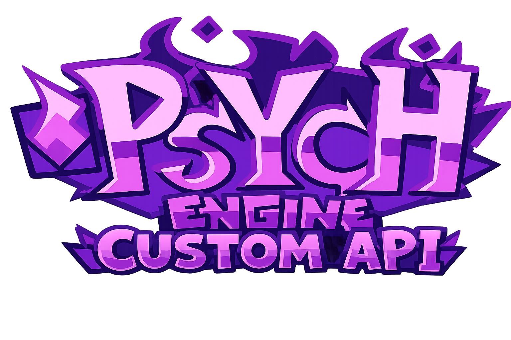

**Friday Night Funkin': Psych Engine** — 功能丰富的 FNF 模组引擎，支持多 API 渲染（Metal, Vulkan, DirectX 12/11/9, OpenGL）和 hxvlc (libVLC) GPU 加速视频播放。

> 🇺🇸 [English Documentation](README.md)

---

# 编译指南

## 前置依赖

| 依赖 | 版本 | 说明 |
|---|---|---|
| **Haxe** | 4.3.6+ | [下载](https://haxe.org/download/version/4.3.6) |
| **git** | 任意 | [下载](https://git-scm.com) |
| **macOS** | Xcode CLT 15+ | `xcode-select --install` |
| **Windows** | Visual Studio 2022 | `VC.Tools.x86.x64` + `Windows10SDK.19041` |
| **Linux** | g++ 11+ / make / nasm | `sudo apt install g++ make nasm` |

## 快速开始

### macOS / Linux

```bash
cd FNF-PsychEngine-CustomAPI
chmod +x setup/unix.sh
./setup/unix.sh
haxelib run lime build mac     # macOS
haxelib run lime build linux   # Linux
```

### Windows

```cmd
cd FNF-PsychEngine-CustomAPI
setup\windows.bat
haxelib run lime build windows
```

## 完整依赖清单

执行 `setup/unix.sh` 或 `setup/windows.bat` 会自动安装以下所有依赖：

### Haxelib 包

| 包 | 版本 | 安装指令 |
|---|---|---|
| **lime** | 8.2.0 | `haxelib install lime 8.2.0` |
| **openfl** | 9.3.3 | `haxelib install openfl 9.3.3` |
| **flixel** | 5.6.1 | `haxelib install flixel 5.6.1` |
| **flixel-addons** | 3.2.2 | `haxelib install flixel-addons 3.2.2` |
| **flixel-tools** | 1.5.1 | `haxelib install flixel-tools 1.5.1` |
| **hscript-iris** | 1.1.3 | `haxelib install hscript-iris 1.1.3` |
| **tjson** | 1.4.0 | `haxelib install tjson 1.4.0` |
| **hxdiscord_rpc** | 1.2.4 | `haxelib install hxdiscord_rpc 1.2.4` |
| **hxcpp** | 4.3.2 | `haxelib install hxcpp 4.3.2` |
| **hxvlc** | 2.3.0 | `haxelib install hxvlc` |

### Git 包

| 包 | 仓库 | Commit | 安装指令 |
|---|---|---|---|
| **flxanimate** | `https://github.com/Dot-Stuff/flxanimate` | `768740a` | `haxelib git flxanimate https://github.com/Dot-Stuff/flxanimate 768740a56b26aa0c072720e0d1236b94afe68e3e` |
| **linc_luajit** | `https://github.com/superpowers04/linc_luajit` | `1906c4a` | `haxelib git linc_luajit https://github.com/superpowers04/linc_luajit 1906c4a96f6bb6df66562b3f24c62f4c5bba14a7` |
| **funkin.vis** | `https://github.com/FunkinCrew/funkVis` | `22b1ce0` | `haxelib git funkin.vis https://github.com/FunkinCrew/funkVis 22b1ce089dd924f15cdc4632397ef3504d464e90` |
| **grig.audio** | `https://gitlab.com/haxe-grig/grig.audio.git` | `cbf91e2` | `haxelib git grig.audio https://gitlab.com/haxe-grig/grig.audio.git cbf91e2180fd2e374924fe74844086aab7891666` |

---

## hxvlc 视频播放

Psych Engine 使用 **hxvlc (libVLC)** 实现 GPU 加速视频播放。VLC 库会自动打包进游戏——无需额外安装 VLC 或任何外部播放器。

### 支持的格式

| 容器 | 视频编码 | 音频编码 | 文件扩展名 |
|---|---|---|---|
| **MP4** | H.264 (AVC) | AAC, MP3 | `.mp4` |
| **WebM** | VP9 | Vorbis, Opus | `.webm` |
| **MKV** | H.264 / VP9 | AAC, Vorbis, Opus | `.mkv` |

> 视频通过 libVLC 直接在 GPU 上解码和渲染。音频由 VLC 原生音频管线处理。视频播放零 CPU 开销。

### Lua 接口

```lua
-- 播放视频
startVideo("intro", true, false, false, true)
-- 参数: (videoName, canSkip, forMidSong, shouldLoop, playOnLoad)

-- 视频元数据查询
local t = getVideoTime()       -- 当前播放位置（秒）
local d = getVideoDuration()   -- 总时长（秒）
seekVideo(10.5)                -- 跳转到 10.5 秒
```

### Mod 中使用

**Chart events（推荐）：**
添加一个名为 `playvideo` 的自定义事件，Value 1 填写视频文件名（不含扩展名）。

**视频文件位置：**
- `mods/<yourMod>/videos/<name>.mp4`（mod 专用）
- `mods/<yourMod>/videos/<name>.webm`
- `assets/videos/<name>.mp4`（共享/回退）
- `assets/videos/<name>.webm`

### 架构

```
┌──────────────────────────────────────────────────────┐
│  PlayState / Lua (startVideo("videos/intro.mp4"))    │
├──────────────────────────────────────────────────────┤
│  objects.VideoSprite (继承 hxvlc.openfl.VideoSprite) │
│    └─ hxvlc (libVLC)                                 │
│         ├─ GPU 解码（VideoToolbox / D3D11 / VAAPI）   │
│         ├─ GPU 渲染（零拷贝纹理）                      │
│         └─ 音频播放（VLC 原生管线）                    │
└──────────────────────────────────────────────────────┘
```

关键特性：
- **GPU 加速**——视频解码和渲染全程在 GPU 上进行，零 CPU 开销
- **VLC 打包**——VLC 库随游戏一起发布，玩家无需额外安装
- **跨平台**——hxvlc 支持 Windows、macOS、Linux、Android、iOS
- **广泛格式**——支持 VLC 能播放的所有格式

### 故障排除

| 症状 | 原因 | 解决方案 |
|---|---|---|
| "Video not found" in debug | 视频文件不存在或格式不支持 | 确认视频在 `mods/<mod>/videos/` 或 `assets/videos/`，格式为 `.mp4` 或 `.webm` |
| 视频不播放 / 黑屏 | VLC 库未打包 | 运行 `haxelib install hxvlc`——VLC 库会自动打包 |
| Linux: 缺少 VLC 依赖 | 系统未装 VLC | `sudo apt install vlc`（或其他发行版对应命令） |

---

---

## bgfx 多 API 渲染

Psych Engine 使用 bgfx 实现跨平台多 API 渲染，支持运行时切换。

### 编译 bgfx 库

```bash
# macOS / Linux
cd libs/hxbgfx/project
chmod +x build_bgfx_libs.sh
./build_bgfx_libs.sh

# Windows（需要 Git Bash 或 WSL）
cd libs/hxbgfx/project
bash build_bgfx_libs.sh
```

### 各平台支持的 API

| 平台 | 可选 API | 默认 |
|---|---|---|
| **macOS** | Metal, OpenGL | Metal |
| **Windows** | DirectX 12, DirectX 11, DirectX 9, Vulkan, OpenGL | DirectX 12 |
| **Linux** | Vulkan, OpenGL | Vulkan |

---

## 项目结构

```
FNF-PsychEngine-CustomAPI/
├── source/                       # Haxe 源码
│   ├── backend/                  # 渲染后端 + 工具类
│   │   ├── GraphicsAPI.hx           # API 选择/切换
│   │   ├── GraphicsAPIType.hx       # 枚举类型定义
│   │   ├── RenderDevice.hx          # bgfx 渲染抽象层
│   │   ├── BgfxAPI.hx               # bgfx C API 接口
│   │   ├── BgfxFallback.hx          # 初始化/回退
│   │   ├── BgfxWindowManager.hx     # 窗口管理
│   │   ├── BgfxTextureManager.hx    # 纹理管理
│   │   ├── BgfxShaderManager.hx     # Shader 管理
│   │   ├── PsychCamera.hx           # bgfx 相机
│   │   ├── ClientPrefs.hx           # 设置存储
│   │   └── Paths.hx                 # 资源路径（支持 mp4 + webm）
│   ├── objects/                  # 游戏对象
│   │   └── VideoSprite.hx           # 视频播放封装（skip UI + 回调）
│   ├── states/                   # 游戏状态
│   │   └── PlayState.hx             # startVideo() API
│   ├── psychlua/                 # Lua 脚本
│   │   └── FunkinLua.hx             # Lua 视频接口
│   ├── shaders/                  # 内嵌 GLSL Shader
│   └── options/                  # 设置菜单
├── libs/                         # 原生库
│   ├── hxbgfx/                   # bgfx 渲染库
│   │   ├── project/
│   │   │   ├── Build.xml            # hxcpp 链接配置
│   │   │   ├── bgfx_bridge.cpp      # 平台窗口句柄桥接
│   │   │   └── build_bgfx_libs.sh   # bgfx 编译脚本
│   │   └── lib/                     # 编译产物
├── Project.xml                   # Lime 项目配置
├── setup/                        # 平台安装脚本
│   ├── unix.sh
│   ├── windows.bat
│   └── windows-msvc.bat
├── assets/                       # 游戏资源
└── docs/                         # 文档
```

---

## 配置选项

### 图形 API

在 `Project.xml` 中：

```xml
<!-- bgfx 多 API 渲染（默认启用） -->
<define name="BGFX_RENDERER" />

<!-- 强制指定编译时 API（可选） -->
<!-- -D GRAPHICS_API_OPENGL    强制 OpenGL -->
<!-- -D GRAPHICS_API_METAL     强制 Metal -->
<!-- -D GRAPHICS_API_VULKAN    强制 Vulkan -->
<!-- -D GRAPHICS_API_DIRECTX12 强制 DirectX 12 -->
<!-- -D GRAPHICS_API_DIRECTX11 强制 DirectX 11 -->
<!-- -D GRAPHICS_API_DIRECTX9  强制 DirectX 9 -->
```

在游戏设置中（运行时切换，即时生效）：

```
Options → Graphics → Graphics Rendering API
  - Auto: 自动测试所有可用 API，选出稳定性得分最高的
    （按 ENTER 运行测试）
  - Metal / DirectX 12 / DirectX 11 / DirectX 9 / Vulkan
  - OpenGL
```

### 首次启动设置

在第一次启动时，标题画面出现之前，Psych Engine 会询问：

> "Looks like it is your first time running the Custom API Psych Engine!
>  Do you want to do a test for the best graphics API for your computer?"

- **Yes** — 运行完整的 GPU 测试并保存得分最高的 API
- **No** — 跳过测试，默认使用 OpenGL

此对话框仅出现一次（结果会持久保存）。之后如需更改 API，请前往 `Options → Graphics → Graphics Rendering API`。

### Auto API 检测

当在图像设置中选择 "Auto" 并按下 ENTER 确认时，Psych Engine 会对每个可用的图形 API 进行 3 秒时间窗口测试 —— 记录每帧时间戳以测量持续帧率和帧时间一致性（标准差）。**稳定性得分**（持续帧率 × 一致性系数）最高的 API 将被保存并用于后续所有会话。

- 测试同步运行，在 5 个 API 的 Windows 系统上约需 15 秒（每个 API 3 秒）。现代 GPU 如果可用 API 较少则更快
- 如需重新测试，再次选择 "Auto" 并按 ENTER 即可
- 结果会持久保存到设置文件中，下次启动直接使用

### 其他功能开关

在 `Project.xml` 中注释/删除对应行：

| 功能 | Define |
|---|---|
| Lua 脚本 | `LUA_ALLOWED` |
| HScript | `HSCRIPT_ALLOWED` |
| 视频播放 | `VIDEOS_ALLOWED` |
| Discord RPC | `DISCORD_ALLOWED` |
| Mod 支持 | `MODS_ALLOWED` |
| 成就系统 | `ACHIEVEMENTS_ALLOWED` |

---

## Reference

- **Psych Engine GitHub:** [ShadowMario/FNF-PsychEngine](https://github.com/ShadowMario/FNF-PsychEngine)
- **Psych Engine Lua Wiki:** [shadowmario.github.io/psychengine.lua](https://shadowmario.github.io/psychengine.lua)
- **hxvlc:** [github.com/MAJigsaw77/hxvlc](https://github.com/MAJigsaw77/hxvlc)
- **VLC / libVLC:** [videolan.org](https://www.videolan.org/vlc/libvlc.html)
- **Haxe:** [haxe.org](https://haxe.org)
- **OpenFL:** [openfl.org](https://openfl.org)
- **Lime:** [github.com/openfl/lime](https://github.com/openfl/lime)
- **HaxeFlixel:** [haxeflixel.com](https://haxeflixel.com)
- **bgfx:** [github.com/bkaradzic/bgfx](https://github.com/bkaradzic/bgfx)
- **Friday Night Funkin':** [funkin.me](https://funkin.me)

---

## Credits

- **Shadow Mario** — Main Programmer, Head of Psych Engine
- **Riveren** — Main Artist/Animator
- **bbpanzu** — Ex-Team Member (Programmer)
- **crowplexus** — HScript Iris, Input System v3
- **Kamizeta** — Creator of Pessy (Psych Engine Mascot)
- **MaxNeton** — Loading Screen Easter Egg Artist/Animator
- **Keoiki** — Note Splash Animations and Latin Alphabet
- **SqirraRNG** — Crash Handler, Chart Editor Waveform
- **EliteMasterEric** — Runtime Shaders Support
- **MAJigsaw77** — Original .MP4 Video Loader Library (hxvlc)
- **iFlicky** — Composer of Psync, Tea Time
- **KadeDev** — Chart Editor Fixes
- **superpowers04** — LUA JIT Fork
- **CheemsAndFriends** — FlxAnimate
- **Ezhalt** — Pessy Easter Egg Jingle
- **MaliciousBunny** — Final Update Video
- **ninjamuffin99** — Friday Night Funkin' Creator

---

*Psych Engine by ShadowMario | Friday Night Funkin' by ninjamuffin99*
